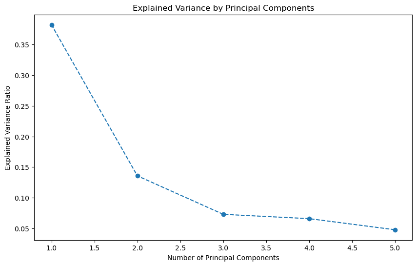
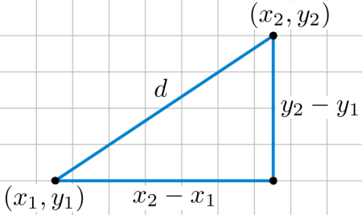

# NHL "Money Ball" Team Builder and AI Simulator

## Table of Contents ##
<ul>
<li>Introduction</li>
<li>Project Goals</li>
<li>Features</li>
<li>Machine Learning Models</li>
<li>Data Sources</li>
<li>Challenges</li>
<li>Usage</li>
<li>Future Work</li>
<li>Contributing</li>
<li>License</li></ul>

## Introduction ##
This project aims to build a Moneyball-type team for the NHL by leveraging machine learning models to predict player performance and salaries. The project includes a Streamlit app that allows users to build their dream team under a salary cap of $30M. The Recommender Engine will give the user a list of 5 players who are closest in playing style according to a set of features from [Money Puck](href='https://moneypuck.com/) as well as their salary. Once the user has picked their team, they can click on the  AI tool to build a team based off their selections, the AI tool will then pick the best team they can under 30M. Next the user can have a simulation game using another Recommender Engine built using pca components to give weight to certain features. The final score will evaluate how well the user did in picking their team!

## Project Goals ##
- Complete linear regression models for forwards and defense to predict player salaries.
- Create a recommender engine to suggest 5 closest players to chosen player.
- Develop a Streamlit app for users to pick players and build their team.
- Simulate games between user-selected teams and AI-generated teams.

## Features ##
- Player Recommender: Suggests similar players based on user input. 
Example using Connor Bedard:  
Because you like Connor Bedard, you might also enjoy these similar players:

| Name           | Position |
| -------------- | -------- |
| Trevor Zegras  | F        |
| Brad Richards  | F        |
| Jack Hughes    | F        |
| Tim Stützle    | F        |
| Adam Fantilli  | F        |

- Team Builder: Allows users to build their dream team under a salary cap.
- Game Simulator: Simulates games between user-selected teams and AI-generated teams.
- Player Comparisons: Provides player comparisons based on historical data.
- All players named since 2008, this gives more data for closest players, salaries have been adjusted
to modern times. Having these player options allows the user to get a feel for what a younger player's
career may look like.

## Machine Learning Models ##
- PCA (Principal Component Analysis): Used to give weight to certain features for player comparisons. PCA gave me 3 important loadings to use for the unsuperized learning method.

- Used Kmeans, Hierarchical and, PCA for hyperparamtuning:

 

- Cosine Similarity: Used in the recommender engine for the simulator. 
- Cosine Similarity is a metric, helpful in determining, how similar the data objects are irrespective of their size. We can measure the similarity between two sentences in Python using Cosine Similarity. In cosine similarity, data objects in a dataset are treated as a vector. 
 
The following map illustrates the vector similarity based on colour, red being closest to the ‘θ’   If θ = 0°, the ‘x’ and ‘y’ vectors overlap, thus proving they are similar.
If θ = 90°, the ‘x’ and ‘y’ vectors are dissimilar. 
 
​

- Euclidean Distances: Used for the Player Recemmender Engine:
- Euclidean distance is like measuring the straightest and shortest path between two points. 
 
Plot showing relationship of features in Euclidean space for the Recommender Engine. 
 

## Data Sources & other Useful Things ##
[Cap Wages](CapWages.com) Used to scrape active player advanced statistics. 
[Puck Pedia](puckpedia.com) Used for player references.  
[Quant Hockey](quanthockey.com) Used to scrape player career stats. 
[Docs Streamlit](https://docs.streamlit.io/) Used for references on Streamlit developing. 
[Co-Pilot](https://copilot.microsoft.com) Used for helping with testing and developing. 
[GeeksforGeeks](https://www.geeksforgeeks.org/cosine-similarity/) Used for educational purposes. 

## Challenges ##
- Scraping and matching player salaries from different data sources. In the end I wasn't able to retrieve the salaries I needed to build a linear Regression model so I used if/else for salary based off goals,  points and, games played.
- Handling misspelled names and matching player IDs across datasets. Luckily the NHL has a player_id system but every database uses different styles to the name col, wrote a simple function to strip punctuation, first and last name, then rearrange according to the need.
- Implementing a recommender engine that suggests players based on user preferences and remaining salary cap. Had to implement a lot of tweaking and testing to get the result I was looking for. You can find the code in the game_simulator, goalies, forwards and, defense notebooks.

## Usage ##
The idea behind this app is to get a Daily Fantasy Salary Cap from an existing website. Adjust the salaries in the 
- forward_rec_two
- defense_rec_two
csv files and create a team then run the AI team. Once both teams have been populated, then have them play a game to see which team to use on the fantasy site
You can also just test your player knowledge and try to beat the AI

## Setup: 
1. Clone the repository and install the required dependencies.
2. Run the App: Start the Streamlit app using the command `streamlit run streamlit_app.py`.
3. Build Your Team: Use the app to select your favorite players and build your team under the salary cap.
4. Simulate Games: Simulate games between your team and AI-generated teams.

## Setup: Adjust Salaries, players etc ##
1. Open the forward_rec_two, defense_rec_two files, and adjust salary col according to the fantasy site's
salaries
2. If you want active players only, you'll need to remove inactive players from the files as well. 

## Future Work ##
- Add more visualizations and markdowns to the notebooks.
- Write additional tests to ensure code robustness.
- Enhance the salary prediction model to account for adjusted era considerations.
- Integrate more data sources and APIs for player information and images for the app.
- Integrate daily betting sites api numbers into the data stream so it can live update salary, stats.
- Make UI much easier to work with, time constraints made for a basic setup
- Implement a Goalie category. I ran out of time.
- Create a more robust simuation engine where the simulator does multiple tests
- Add a salary column to the players recommended list

## Contributing ##
Contributions are welcome! Please fork the repository and submit a pull request with your changes.

## License ##
This project is licensed under the MIT License.
